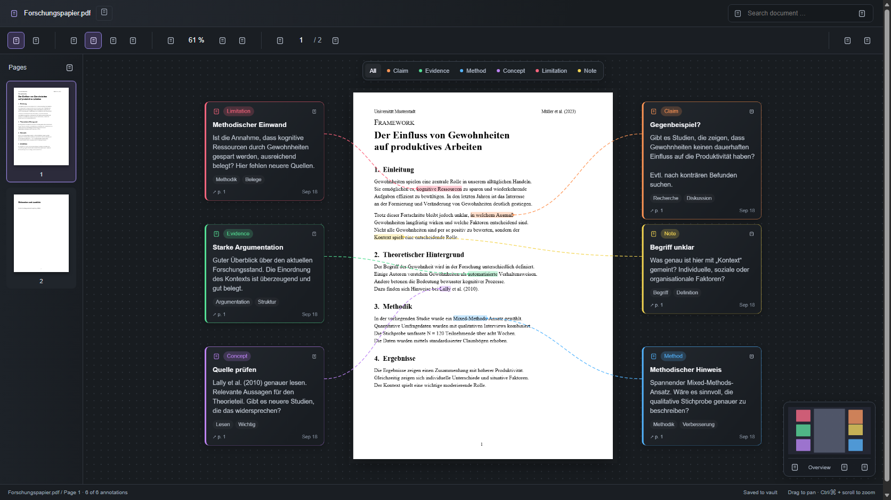

# Remark My Words

**Read a PDF. Mark a passage. Give your thoughts room.**

Remark My Words is an Obsidian community plugin for reading and annotating PDFs.
Write categorized comments beside passages, then switch to a canvas where your
notes become movable cards connected to the original text.
Use it for manuals, reports, books, articles, and other PDF documents in your vault.



*Canvas preview with a sample document in the browser test harness. Obsidian supplies the actual toolbar icons.*

## Read closely, think spatially

| Reading mode | Canvas mode |
| --- | --- |
| Focus on one PDF page with normal scrolling. | Arrange comment cards around the PDF. |
| Select a passage and add a comment from the floating toolbar. | Follow colored connectors back to the source passage. |
| Hover a highlight to read, edit, or delete its comment. | Pan, zoom, filter categories, and navigate with the minimap. |
| Keep your reading position when saving a comment. | Keep your card positions when switching modes. |

Classify annotations as **Claim**, **Evidence**, **Method**, **Concept**,
**Limitation**, or **Note**. Each comment can have a title, description, and tags.
Page thumbnails, document search, and document-wide notes are included.

## Install

Initial release target: **Obsidian Desktop 1.13.7 or later**, using an up-to-date
Obsidian installer. Mobile support is not enabled for the initial release.

### Manual installation

Until the plugin is approved for the Community directory:

1. Open [Releases](https://github.com/hoelk-f/remark-my-words/releases) and choose a published release. If none is available yet, use the source-build instructions below.
2. Download the attached **main.js**, **manifest.json**, and **styles.css** files. GitHub's automatic source-code archive is not the installable plugin.
3. Create `<your-vault>/.obsidian/plugins/remark-my-words/` and put those three files inside it.
4. Reload Obsidian, open **Settings → Community plugins**, and enable **Remark My Words**.

The PDF renderer and worker are included in `main.js`; no additional worker file
or internet connection is needed to read and annotate documents.

After approval, users will be able to find **Remark My Words** under
**Settings → Community plugins → Browse**. A GitHub release alone does not make
it available in that directory.

### Build from source

With Node.js 22 or later:

```sh
git clone https://github.com/hoelk-f/remark-my-words.git
cd remark-my-words
npm ci
npm run package:release
```

Copy the contents of `dist/remark-my-words/` into the plugin folder above.

## Get started

1. After installing, enable **Remark My Words** under **Settings > Community plugins**.
2. Run **Remark My Words: Open PDF** from the command palette or click the pen-and-file ribbon icon. The active PDF opens immediately; otherwise choose a PDF from the vault. You can also right-click a PDF and choose **Open in Remark My Words**.
3. Use the **book** icon for Reading or the **dashboard** icon for Canvas. Tooltips identify each control.
4. Select text, click a category in the floating toolbar, and fill in **Add comment**. Right-clicking selected text also offers categories.
5. In Reading, hover a highlighted passage to read its comment. The **Read page comments** button also works with a keyboard or touch input.
6. In Canvas, drag a card by its header. Double-click it to edit; its **…** menu provides category changes and deletion. **↗ p. …** takes you back to the passage.

Navigate pages with thumbnails, arrows, or the page number. Search with Enter
for the next matching page or Shift+Enter for the previous one. The **…** toolbar
menu can reopen the document in Obsidian's native PDF viewer.

## Customize categories

Click the **tags** icon (**Manage categories**) in the PDF toolbar. The same
manager is available from **Settings > Remark My Words** and the command palette.
Add a category, change its name, color, or icon, or delete it; then choose
**Save categories**. **Cancel** leaves the previous settings unchanged.

The initial categories remain **Claim, Evidence, Method, Concept, Limitation,
and Note**. Changes apply across PDFs in this vault and survive restarting
Obsidian. Keep at least one category. Deleting a category removes it from new
comment choices; existing comments keep their category and remain editable.
An existing deleted category appears as **(deleted)** in the comment editor.

## Your data stays in your vault

The plugin does not send PDFs, comments, or notes to an external service. It has
no accounts, telemetry, or paid features. Normal reading and annotation do not
make network requests. Plugin installation and updates are handled by Obsidian
and GitHub.

Comments and notes are stored beside the PDF in a readable JSON file:

```text
document.pdf
document.pdf.obsidian-annot.json
```

The original PDF is not modified. Keep the PDF and its annotation file together
when moving or backing up your documents. Renaming the PDF currently requires
renaming its annotation file to match. Your vault's existing sync service can
sync these files; the plugin does not provide its own synchronization.

### Upgrading from the old development name

If you installed `obsidian-pdf-annotator-comment`, disable that plugin first and
install this version in `remark-my-words`. Avoid enabling both versions together.
Existing `.obsidian-annot.json` files are reused; you do not need to rename them
for the plugin rename. Old categories are migrated while preserving comments,
coordinates, and card positions. Reassign any command hotkeys under the new
plugin name. See [data compatibility](docs/DEVELOPMENT.md#data-compatibility).

## Keyboard shortcuts

| Shortcut | Action |
| --- | --- |
| V / H | Select text / pan canvas |
| + / − | Zoom in / out |
| Ctrl/⌘ + wheel | Zoom around the pointer |
| 0 | Fit page and cards in Canvas; fit page width in Reading |
| Page Up / Page Down | Previous / next page |
| Ctrl/⌘ + F | Search this PDF |
| Escape | Dismiss a preview or clear the selection |
| Arrow keys on a focused card | Move by 10 units; Shift moves by 40 |
| Enter on a focused card | Edit the comment |
| Ctrl/⌘ + Enter in the description field | Save the comment |

## Current limits

- One PDF page is displayed at a time in both modes.
- Scanned documents need an existing text layer; OCR is not included.
- Annotations live in the JSON file, not as native annotations inside the PDF.
- Search jumps between matching pages; phrases spanning multiple PDF text runs may not be fully highlighted.
- Concurrent edits to the same PDF from multiple views or devices are not merged.
- The initial release targets desktop. Automated browser tests do not replace testing in Obsidian, and mobile compatibility has not been verified.

## Feedback and development

[Report a bug or request a feature](https://github.com/hoelk-f/remark-my-words/issues).
For bugs, include your Obsidian version, plugin version, operating system, and
steps to reproduce. Share only non-sensitive sample documents.

- [Contributing](CONTRIBUTING.md)
- [Development, architecture, and data format](docs/DEVELOPMENT.md)
- [Release and Community directory submission guide](docs/RELEASING.md)
- [Changelog](CHANGELOG.md)

## Maintainer: publish an update

Run `npm run release` from an up-to-date checkout of `main`. The script publishes
the current version on the first run and increments the patch version for later
updates. It includes all non-ignored local changes, runs checks, builds, commits,
tags, pushes, and waits for GitHub Actions to publish the three installable files.
Use `npm run release:preview` to preview the plan without changes.
See the [release guide](docs/RELEASING.md) for prerequisites, version options,
recovery, and the one-time Obsidian Community submission.

## License

Remark My Words is released under the [MIT License](LICENSE).
PDF rendering uses Mozilla's [PDF.js](https://mozilla.github.io/pdf.js/), licensed
under [Apache 2.0](docs/licenses/pdfjs-dist.txt). License notices are retained in
the distributed bundle. See [third-party notices](THIRD_PARTY_NOTICES.md).

This is an independent community project, not an official Obsidian product.
